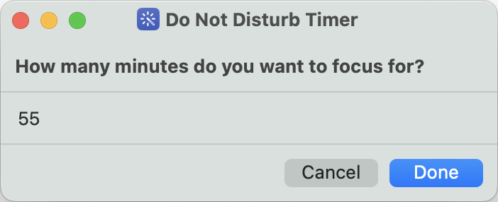
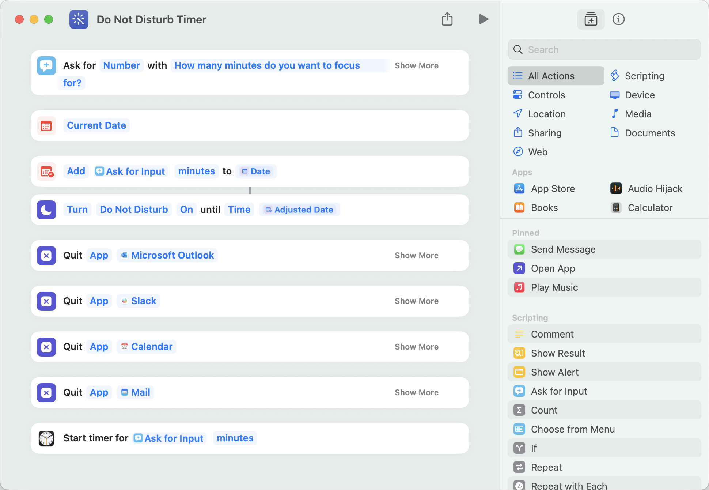

Just made my own pomodoro timer using Apple shortcuts. There are so many fancy apps for this but lately I sorta got this urge to make my own stuff (as long as it's reasonably simple).

When you start the shortcut it comes up like this and asks you for how long you'd like to not be disturbed:

Enter the number of minutes you want to work and it will:

1. Quit a couple apps like Slack, Mail, Calendar, etc..
2. Start a timer for the specified number of minutes
3. Set your Mac to Do Not Disturb mode (which also syncs to my iPhone and Apple Watch which is just super awesome)

My setup is this:

You can download the shortcut here if you like: [Pomodoro Timer](/downloads/dnd-timer-shortcut.zip)
